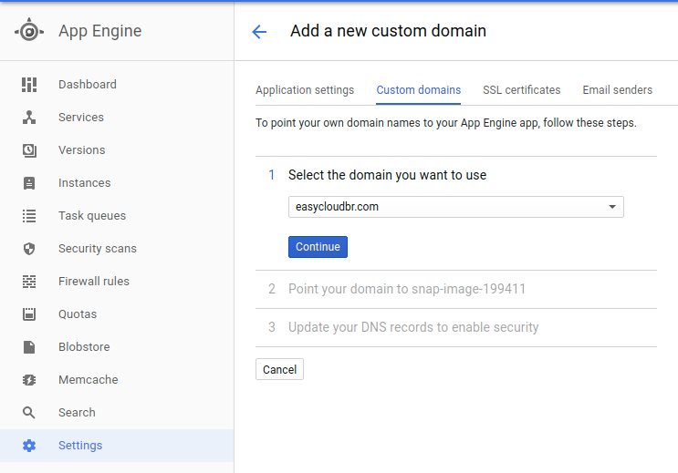

Usando Let’s Encrypt no App Engine
---
[Let’s Encrypt](https://letsencrypt.org/) é um CA (Certificate Authority) open, ou seja, totalmente free, com ele podemos gerar certificados digitais (SSL) para websites, microservices entre outros casos de uso.

Tecnologias
---
Este artigo está utilizando as seguintes tecnologias:

  - [Let’s Encrypt](https://letsencrypt.org/)
  - [Python](https://www.python.org/)
  - [Flask](http://flask.pocoo.org/)
  - [Google App Engine](https://cloud.google.com/appengine/)
  
 Pré Requisitos
  ---
 Para executar o exemplo do Let's Encrypt você vai precisar de um projeto no [Google Cloud Platform](https://console.cloud.google.com) e ter instalado o [Google Cloud SDK](https://cloud.google.com/sdk/downloads?hl=pt-br).
 Para saber mais sobre como criar um projeto no Googe Cloud clique [aqui](https://cloud.google.com/sdk/downloads?hl=pt-br) e siga as instruções para criar seu projeto.
 
Digite no terminal do seu sistema operacional
```
gcloud init
```
Siga as instruções e logue no seu projeto do GCP (Google Cloud Platform).

Faça o download do repositório com o código fonte:

```
https://github.com/carlosrgomes/sample-letsencrypt.git
```

Entre no diretório sample-letsencrypt e faça o deploy da sua aplicação no App Engine com o comando:
```
gcloud app deploy
```

Faça o download do [Let’s Encrypt](https://letsencrypt.org/) em outro diretório:

```
git clone https://github.com/letsencrypt/letsencrypt
cd letsencrypt
./letsencrypt-auto --help
```

Configurando seu domínio
---
No Console do GCP temos que entrar no Settings do App Engine conforme pode observar na imagem.




Siga as intruções e configure o domínio de sua aplicação. No final das configuraes você será capaz de entrar no site através do configurado. Por exemplo quando escrevi esse artigo o domínio da minha aplicação ficou acessível através do link:
[http://easycloudbr.com/](http://easycloudbr.com/)


Gerando o SSL
---
Dentro da pasta letsencrypt vamos executar o comando

```bash
sudo ./letsencrypt-auto certonly --manual --email seuemail@email.com -d seudominio.com
```
Logo após esse comando o letencrpty vai apresentar a seguinte mensagem:

```
-------------------------------------------------------------------------------
NOTE: The IP of this machine will be publicly logged as having requested this
certificate. If you're running certbot in manual mode on a machine that is not
your server, please ensure you're okay with that.

Are you OK with your IP being logged?
-------------------------------------------------------------------------------
(Y)es/(N)o: Y

```
Confirme digitando "Y"

O [Let’s Encrypt](https://letsencrypt.org/) vai criar uma chave e um valor que você precisa utilizar no código da aplicação que deseja gerar o SSL.

Conforme pode observar no exemplo abaixo.

```
-------------------------------------------------------------------------------
Create a file containing just this data:

J_Y_SHt8Pcvd6aFDtvhvunP2z99YGJj8kDeDRpCU6xg.89n5ovJLN0aPGfXjM5TBFporRo0qvYDmO4nwmbvUxFk

And make it available on your web server at this URL:

http://easycloudbr.com/.well-known/acme-challenge/J_Y_SHt8Pcvd6aFDtvhvunP2z99YGJj8kDeDRpCU6xg

-------------------------------------------------------------------------------
Press Enter to Continue
Waiting for verification...
Cleaning up challenges
```
Nesse exemplo a chave será J_Y_SHt8Pcvd6aFDtvhvunP2z99YGJj8kDeDRpCU6xg e o valor J_Y_SHt8Pcvd6aFDtvhvunP2z99YGJj8kDeDRpCU6xg.89n5ovJLN0aPGfXjM5TBFporRo0qvYDmO4nwmbvUxFk

Vamos precisar alterar o arquivo main.py nele temos um contexto /.well-known/acme-challenge/<challenge> configurado como @app.route('/.well-known/acme-challenge/<challenge>') o [Let’s Encrypt](https://letsencrypt.org/) utiliza esse contexto para validar e gerar o certificado ssl. Você vai precisar substituir dentro do dict da função a chave e os valores gerados pelo [Let’s Encrypt](https://letsencrypt.org/) conforme o código:
  
```python
@app.route('/.well-known/acme-challenge/<challenge>')
def letsencrypt_check(challenge):
    challenge_response = {
        "chave_aqui":"valor_aqui",
        "chave_aqui":"valor_aqui"
    }
    return flask.Response(response= challenge_response[challenge], status=200, mimetype='text/plain')
```

Coformem os valores anteriomente citados o código ficaria assim:

```python
@app.route('/.well-known/acme-challenge/<challenge>')
def letsencrypt_check(challenge):
    challenge_response = {
        "J_Y_SHt8Pcvd6aFDtvhvunP2z99YGJj8kDeDRpCU6xg":"J_Y_SHt8Pcvd6aFDtvhvunP2777Jj8kDeDRpCU6xg.89n5ovJL777jM5TBFporRo0qvYDmO4nwmbvUxFk",
        "<challenge_token>":"<challenge_response>"
    }
    return flask.Response(response= challenge_response[challenge], status=200, mimetype='text/plain')
 ```
Salve o arquivo e faça um novo deploy na aplicação com o comando:

```
gcloud app deploy
```

Precione a tecla enter no terminal do [Let’s Encrypt](https://letsencrypt.org/) .

Se tudo estiver correto será apresentado uma mensagem parecida com a mensagem abaixo:

```
IMPORTANT NOTES:
 - Congratulations! Your certificate and chain have been saved at:
   /etc/letsencrypt/live/easycloudbr.com/fullchain.pem
   Your key file has been saved at:
   /etc/letsencrypt/live/easycloudbr.com/privkey.pem
   Your cert will expire on 2018-07-18. To obtain a new or tweaked
   version of this certificate in the future, simply run
   letsencrypt-auto again. To non-interactively renew *all* of your
   certificates, run "letsencrypt-auto renew"
 - If you like Certbot, please consider supporting our work by:

   Donating to ISRG / Let's Encrypt:   https://letsencrypt.org/donate
   Donating to EFF:                    https://eff.org/donate-le
```

Copie os arquivos que foram gerados par ao desktop ou alguma pasta pública:

```
cp /etc/letsencrypt/live/easycloudbr.com/fullchain.pem /home/suapasta/
cp /etc/letsencrypt/live/easycloudbr.com/privkey.pem /home/suapasta/
```


